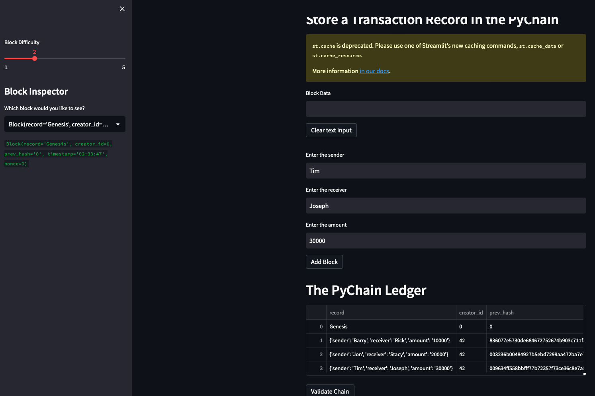
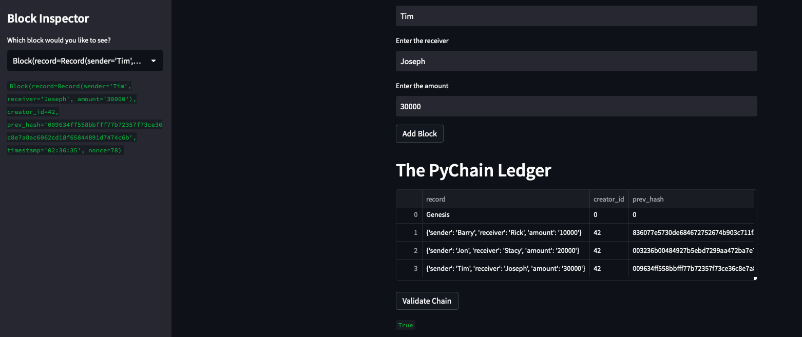
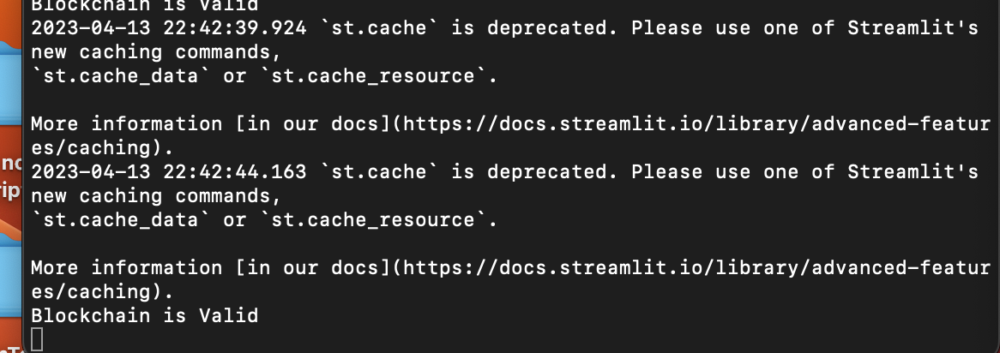

# Challenge Assignment 18

The first screenshot required for this assignment is to show a blockchain consisting of several blocks. Please see below:

The next requirement is to confirm a blockchain is valid with a message of "Blockchain is Valid" message. 

 
